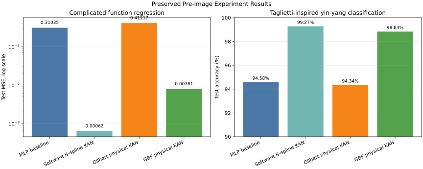

# Preserved Results Comparison

This page keeps the non-image results that were obtained before the later image benchmark branch of the project. The preserved result set is anchored to the project state at commit `f0f933b`, before image benchmark commits were added. The cleaned project focuses on four retained model routes:

- MLP baseline;
- software cubic B-spline KAN;
- Gilbert-multiplier physical KAN;
- generalized-bell-function physical KAN.



## Comparison Table

| Model route | Complicated function result | Taglietti-inspired yin-yang result | Main source |
| --- | ---: | ---: | --- |
| MLP baseline | MSE `0.31035` | Accuracy `94.58%` | `docs/kan_baseline_experiments.md` |
| Software B-spline KAN | MSE `0.00062` | Accuracy `99.27%` | `docs/kan_baseline_experiments.md` |
| Gilbert physical KAN | MSE `0.41117` | Accuracy `94.34%` | `docs/inter_layer_normalization_experiment.md` |
| GBF physical KAN | MSE `0.00781` | Accuracy `98.83%` | `docs/gbf_kan_experiment.md` |

## Reading The Result

The software B-spline KAN remains the strongest pure software reference on both original tasks. It is the best regression model and also has the highest yin-yang accuracy.

The GBF physical KAN preserves most of the KAN benefit while staying hardware-oriented. Its mapped physical result is very close to its software result, because the fixed GBF basis is already part of the hardware model and only the linear crossbar coefficients are mapped to conductance states.

The Gilbert physical KAN is still useful because it gives a direct route from polynomial edge functions to multiplier-generated voltage rows and RRAM weights. Its classification result is good, but the regression task exposes sensitivity to multiplier-chain error, scaling, and conductance quantization.

To regenerate the figure:

```powershell
python -m kan_memristor.experiments.visualize_preserved_results
```
